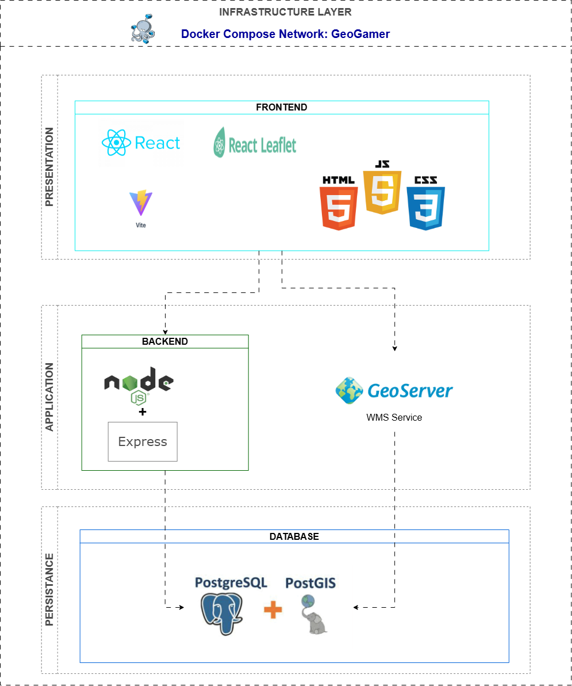
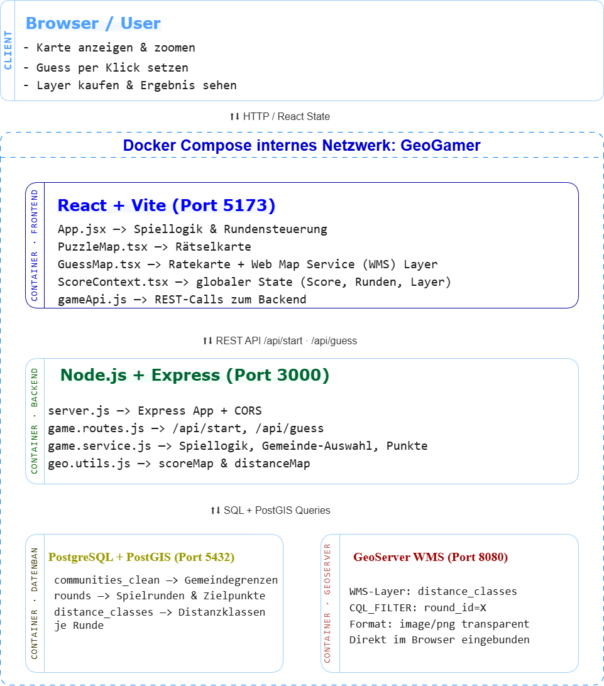
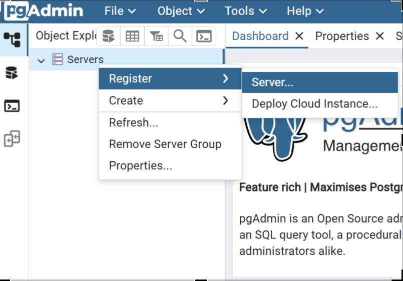
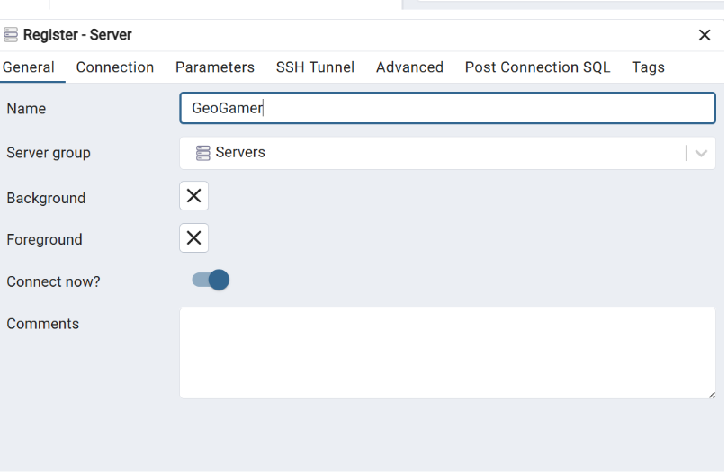
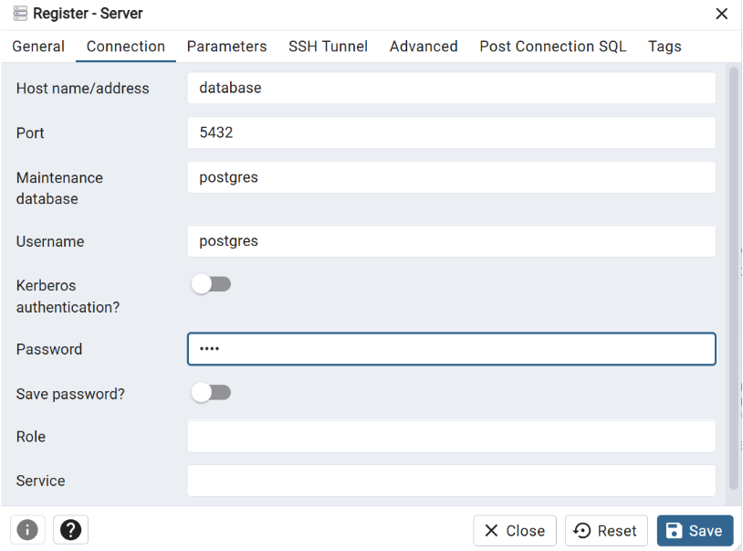

# GeoGamer

GeoGamer is an OGC-compliant WebGIS application for interactively guessing German municipalities. Distance scoring is calculated server-side in PostGIS and visualized thematically via GeoServer as a WMS layer.
The dataset was provided by the [Federal Agency for Cartography and Geodesy (BKG)](https://gdz.bkg.bund.de/index.php/default/verwaltungsgebiete-1-250-000-mit-einwohnerzahlen-stand-31-12-vg250-ew-31-12.html).
The selected format is the archive with the UTM32 Shapefile (as of: 31.12., georeferencing: UTM32s, format: shape, content: layers (ZIP, 68 MB)).

## Architecture

GeoGamer follows a containerized multi-layer architecture:

- **Frontend:** React + Leaflet
- **Backend:** Node.js + Express
- **Database:** PostgreSQL + PostGIS
- **Geoservices:** GeoServer (OGC WMS)
- **Orchestration:** Docker Compose

All services run in an isolated Docker network.





## Features

- Server-side distance calculation (PostGIS, EPSG:25832)
- Hybrid distance classification (identity, adjacency, metric thresholds)
- OGC-compliant WMS (GeoServer + SLD)
- Dynamic filtering via CQL
- Fully containerized (Docker Compose)

## Setup

### Prerequisites

- Docker
- Docker Compose

### Clone the Project

```bash
git clone https://github.com/GeoGamerWiSe25-6/GeoGamer.git # Or extract the ZIP file from the email
cd geogamer
```

### Environment Variables

Before starting the project, create a `.env` fil based on `.env.example`:

```bash
cp .env.example .env
# The MapTiler API key can be found in the documentation under Implementation > 5.3 Frontend > 5.3.1 Component Structure > PuzzleMap.tsx
```

**fill .env in your values:**
\`
VITE_MAPTILER_KEY=your_maptiler_api_key_here
POSTGRES_USER=geogamer
POSTGRES_PASSWORD=geogamer
POSTGRES_DB=geogamer
\`

### Run the Application with Docker

First time build the containers

```bash
docker compose up -d --build
```

Stop the Application und re-run it again:

```bash
docker compose down
# On next start:
docker compose up
```

## Services

| Service   | URL                             | Notes                                 |
| --------- | ------------------------------- | ------------------------------------- |
| Frontend  | http://localhost:5173           |                                       |
| Backend   | http://localhost:3000           |                                       |
| GeoServer | http://localhost:8080/geoserver | Web UI credentials: `admin:geoserver` |
| pgAdmin   | http://localhost:5050           | See setup below                       |

## Browsing the Database with pgAdmin

To connect pgAdmin to the database, follow these steps:

## Accessing PostgreSQL via pgAdmin

pgAdmin is available at:

http://localhost:5050

Login credentials are defined in your `.env` file.

### Register Server

1. Right-click **Servers** → **Register → Server**



2. Under **General**:
   - Name: `GeoGamer`



3. Under **Connection**:
   Enter Connection Parameters According to Your .env File
   - Host: `db`
   - Port: `5432`
   - Database: (e.g. `postgres`)
   - Username: value of `POSTGRES_USER`
   - Password: value of `POSTGRES_PASSWORD`

Click **Save**.



You can now browse tables such as `communities_clean`, `rounds`, and `distance_classes`.

## How to Play

A random location somewhere in Germany is shown on the left map (satellite view).
Use the right map to click where you think that location is. After confirming your guess, you receive points based on how close you were and the map reveals the actual location with color-coded distance zones.

## License

This project was developed as part of a university WebGIS project.
