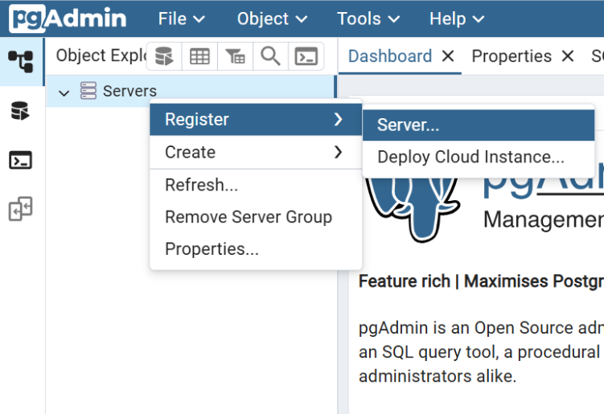
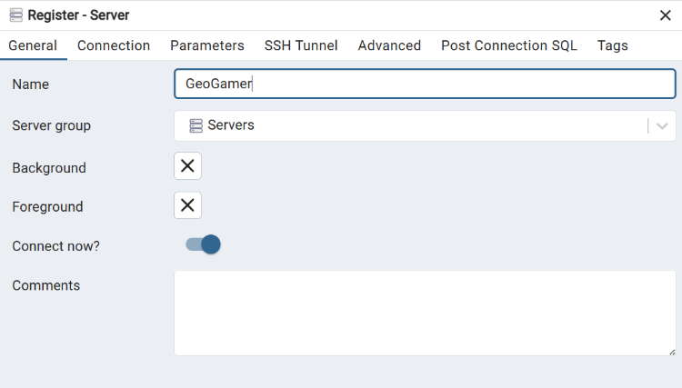

# GeoGamer

GeoGamer ist eine OGC-konforme WebGIS-Anwendung zur spielerischen
Schätzung deutscher Gemeinden. Die Distanzbewertung erfolgt serverseitig
in PostGIS und wird über GeoServer als WMS thematisch visualisiert.
Der Datensatz wurde bereitgestellt durch
das [Bundesamt für Kartographie und Geodäsie](https://gdz.bkg.bund.de/index.php/default/verwaltungsgebiete-1-250-000-mit-einwohnerzahlen-stand-31-12-vg250-ew-31-12.html).
Die gewählte Form ist das Archiv mit dem UTM32 Shapefile (Stand: 31.12., Georeferenzierung: UTM32s, Format: shape
Inhalt: Ebenen (ZIP, 68 MB)).

## Features

- Serverseitige Distanzberechnung (PostGIS, EPSG:25832)
- Hybride Distanzklassifikation (Identität, Nachbarschaft, metrische Schwellen)
- OGC-konformer WMS (GeoServer + SLD)
- Dynamische Filterung per CQL
- Vollständig containerisiert (Docker Compose)

## Setup

### Voraussetzungen

- Docker
- Docker Compose

### Projekt starten

```bash
git clone https://github.com/GeoGamerWiSe25-6/GeoGamer.git # Bzw. die ZIP-Datei aus der Email entpacken
cd geogamer
# Erstellung eigener .env auf Basis von .env.example
  # MapTiler API-Key befindet sich in Dokumentation unter Implementierung > 5.3 Frontend > 5.3.1 Komponentenstruktur > PuzzleMap.tsx
docker compose up -d --build
```

### Applikation beenden

```bash
docker compose down

# Nach Veränderungen im Code oder Konfiguration ggf:
docker compose down -v
# Beim nächsten Start:
docker compose up -d --build
```

Frontend: http://localhost:5173

Backend: http://localhost:3000

GeoServer: http://localhost:8080/geoserver # Zugangsdaten Web-UI admin:geoserver

pgAdmin: http://localhost:5050

Um die Datenbank in pgAdmin zu browsen sind folgende Schritte notwendig:

#### Server registrieren



#### Verbindung benennen



#### Verbindungsparameter gemäß .env-Datei eingeben


## Troubleshooting
### Port bereits genutzt
- Service auf dem Port finden und beenden. Beispiel:
Error response from daemon: failed to set up container networking: driver failed programming external connectivity on endpoint geogamer-db (84d40***): failed to bind host port 0.0.0.0:5432/tcp: address already in use

```bash
sudo systemctl stop postgresql
sudo systemctl disable postgresql
```

## Lizenz

Dieses Projekt wurde im Rahmen eines universitären WebGIS-Projekts erstellt.
